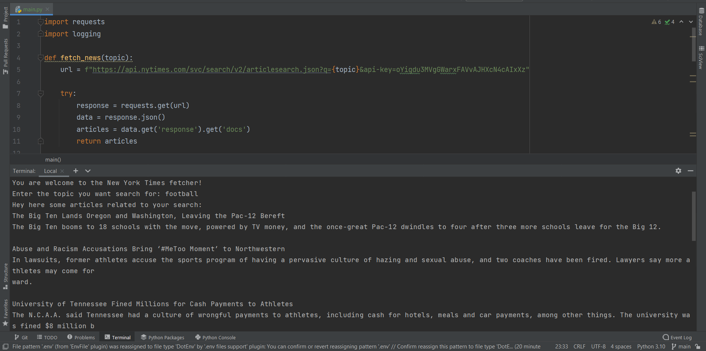

# New_York_Times

## New York Times Article Fetcher

> Простая программа для поиска и вывода новостных статей из базы данных New York Times API.Этот скрипт позволяет пользователю искать новостные статьи по заданной теме с использованием API New York Times. Он выводит заголовки и отрывки статей, связанных с введенной темой.


**Пример программы так работает.**


## Установка

**Для запуска программы необходимо установить следующие зависимости:**

1. Установите Python (версия 3.11.4) на ваш компьютер.

2. Клонируйте репозиторий с GitHub:
    ```bash
    $  git clone git clone  https://github.com/Humoyun004/New_York_Times.git
    ```
3. Для работы скрипта необходимо установить библиотеку requests. Выполните следующую команду для установки библиотеки:
    ```bash
    pip install requests
    ```
4. Перейдите в директорию с программой:
cd Post_From_Link


## Использование
1. **Откройте командную строку или терминал.**

2. **Перейдите в каталог, где находится файл main.py.**

**Запустите программу с помощью следующей команды:**
```bash
$ python main.py 
```
3. **Программа запросит у вас ввести тему для поиска новостных статей.**

4. **Выведет найденные статьи с заголовками и отрывками.**
 

## Пример
> You are welcome to the New York Times fetcher!
Enter the topic you want search for: technology

> Hey here some articles related to your search:
Tech Giants Announce Effort to Increase Access to Green Technologies
The latest tech can make for an easy holiday gift, but when it comes to the most meaningful presents, think how the recipient can use the tech year-round.
...

## Ошибки
**В случае возникновения ошибок при выполнении запросов к API или других проблем, они будут записаны в файл errors.log в формате:**
```
    <дата и время> : <уровень_журнала> : <сообщение_об_ошибке>
```

## Ограничения
**Для использования данной программы вам понадобится ключ API от New York Times. Пожалуйста, убедитесь, что вы включили свой ключ API в строку url в функции main()**

## Автор
> Humoyun

## Вклад
**Если вы хотите внести свой вклад в развитие приложения "New York Times", пожалуйста, следуйте этим шагам:**

1. Форкните репозиторий на GitHub.
2. Клонируйте ваш форк репозитория на локальную машину.
3. Создайте новую ветку для вашей функции или исправления ошибки.
4. Внесите изменения и сделайте коммиты с описательными сообщениями.
5. Отправьте ваши изменения в ваш форк репозитория.
6. Создайте pull request (запрос на включение) в основной репозиторий.


## Контакты
**Если у вас есть вопросы или предложения относительно приложения "New York Times", пожалуйста, свяжитесь с нами по адресу humoyunakbaraliev1@gmail.com. Мы ценим ваше мнение!**


